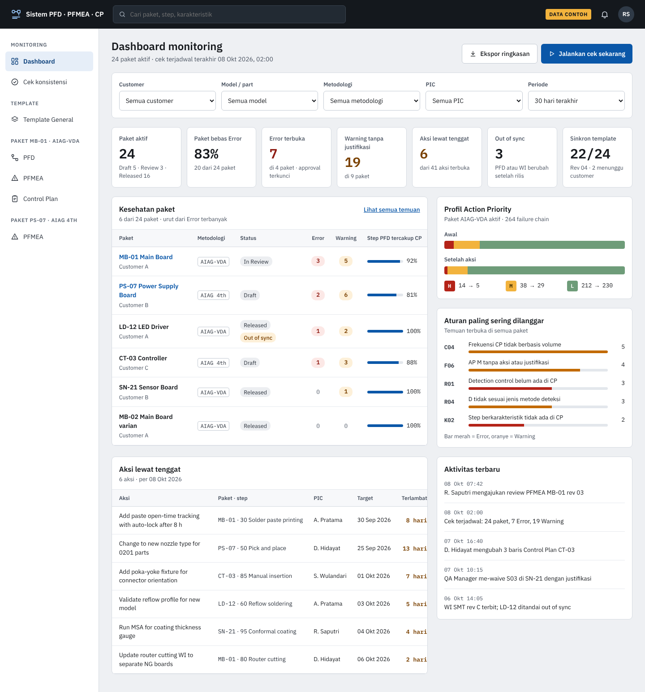

# Sistem PFD · PFMEA · Control Plan

Aplikasi web untuk pabrik elektronik otomotif (PCBA, bersertifikat IATF 16949) yang dipakai
untuk **membuat, mengecek dan memonitor** tiga dokumen mutu yang saling terkait untuk setiap
produk:

- **PFD** (*Process Flow Diagram*): urutan langkah proses, simbol, mesin, karakteristik dan
  alur NG/rework.
- **PFMEA** (*Process Failure Mode and Effects Analysis*): apa yang bisa salah di setiap
  langkah, seberapa parah (S), seberapa sering (O), seberapa mudah terdeteksi (D), dan aksi
  perbaikannya.
- **Control Plan (CP)**: bagaimana setiap karakteristik dikendalikan di lini produksi (teknik
  ukur, ukuran sampel, frekuensi, metode kontrol, reaction plan).

Ide intinya: **tiga dokumen itu adalah tiga tampilan dari satu data proses.** Langkah proses,
karakteristik, simbol karakteristik khusus dan kontrol dimasukkan sekali, lalu tampil
*read-only* di dokumen lain. Hal yang masih bisa tidak konsisten ditangkap otomatis oleh mesin
aturan, dan dashboard menunjukkan kondisi setiap paket.

> **Status:** pengembangan **Tahap 1** sedang berjalan, dikerjakan per milestone (M0–M13).
> Kemajuan setiap milestone dan panduan instalasi ada di
> [`docs/build-guide.md`](docs/build-guide.md).



*Mockup di atas menggambarkan kondisi akhir setelah keempat tahap dan masih memakai label
bahasa Indonesia. Aplikasi yang dibangun menampilkan teks bahasa Inggris; label resminya ada di
[`docs/08-screens.md`](docs/08-screens.md).*

## Masalah yang diselesaikan

| Sekarang (Excel) | Dengan sistem ini |
| --- | --- |
| PFD, PFMEA dan CP adalah file terpisah yang lama-lama tidak sinkron. | Satu data; dokumen tidak bisa saling bertentangan untuk data yang sama. |
| Ketidakkonsistenan dicari manual menjelang audit. | Aturan cek berjalan otomatis saat menyimpan, saat diminta dan setiap malam. |
| Proses umum (receiving, IQC, penyimpanan, packing, pengiriman) di-copy-paste ke setiap model lalu diedit sendiri-sendiri. | **Template General**: ubah sekali, rilis, dan semua paket model ikut diperbarui otomatis. |
| Tidak ada gambaran aksi yang lewat tenggat atau kesehatan dokumen. | Dashboard per customer dan pemilik paket. |

## Isi Tahap 1 (yang sedang dibangun)

Tahap 1 memakai **PFMEA AIAG FMEA edisi ke-4** (S, O, D dan RPN = S × O × D) dan **Control Plan
Template A** (formulir APQP edisi ke-2).

| ID | Kemampuan | Ringkasan |
| --- | --- | --- |
| P1-01 | Login, sesi, peran | Akun lokal (kata sandi argon2id), sesi di PostgreSQL, lima peran; login Active Directory/LDAP opsional lewat konfigurasi (M13). |
| P1-02 | Master data | Customer (ambang RPN, S minimum untuk CC, tabel konversi simbol), kelas karakteristik khusus, part, library kontrol, teks kriteria S/O/D, istilah terlarang, aturan per customer, pengguna, pengaturan. Hanya admin. |
| P1-03 | Paket | Satu paket per part/model berisi PFD, PFMEA dan CP; dibuat dari Template General; nomor dokumen otomatis (`SH-`, `SF-`, `SC-`); pemilik dan anggota. |
| P1-04 | Editor PFD | Tabel langkah proses, karakteristik per langkah, alur NG/rework/scrap/return, diagram alur yang tergambar otomatis, perlindungan hapus. |
| P1-05 | Worksheet PFMEA AIAG 4th | Satu baris per *failure chain*, S = S effect tertinggi, RPN dihitung server, kontrol prevention/detection, rekomendasi aksi dengan PIC dan target, sorting, sorotan S 9–10. |
| P1-06 | Control Plan Template A | Baris per fase (Prototype, Pre-launch, Production); kolom dari PFD tampil read-only; "+ Lines from PFMEA controls". |
| P1-07 | Edit bersamaan | Versi per baris, konflik dijawab 409 beserta nilai terbaru, perubahan pengguna lain tampil langsung, indikator siapa yang sedang membuka paket. |
| P1-08 | Mesin aturan | 32 aturan konsistensi; berjalan setelah menyimpan, saat "Run check", setelah sinkron dan setiap malam; temuan dengan level Error/Warning/Info dan tautan langsung ke sel. |
| P1-09 | Template General | Edit, rilis revisi, sinkron otomatis ke semua paket model, override lokal, konflik, kembali ke revisi lama. |
| P1-10 | Ekspor Excel A3 | PFD, PFMEA dan CP dalam layout Excel perusahaan, A3 landscape, di-cache per versi konten. |
| P1-11 | Dashboard dan pencarian | Kartu KPI, kesehatan paket, profil risiko AIAG 4th, aturan yang paling sering dilanggar, aksi lewat tenggat, aktivitas terbaru, pencarian global. |
| P1-12 | Tempel dari Excel | Tempel blok dari Excel ke dialog pratinjau untuk langkah PFD, baris PFMEA atau baris CP; divalidasi lalu dibuat dalam satu transaksi. |
| P1-13 | Operasional | Deployment Docker Compose, konfigurasi lewat environment variable, endpoint health dan metrics, skrip backup/restore, uji performa. |

**Gate 1** (Tahap 1 dianggap selesai): satu paket nyata dibuat ulang di sistem dan ekspor
Excel-nya sama dengan Excel lama, ke-32 aturan benar pada paket itu, Template General asli sudah
dirilis dan disinkronkan, target performa tercapai di server pabrik, dan backup berhasil
dipulihkan di mesin kedua. Rinciannya di [`docs/11-testing.md`](docs/11-testing.md) §6.

## Peran pengguna di Tahap 1

| Kemampuan | viewer | reviewer | author | approver | admin |
| --- | :-: | :-: | :-: | :-: | :-: |
| Membaca paket, worksheet, temuan, dashboard; ekspor Excel | ✓ | ✓ | ✓ | ✓ | ✓ |
| Membuat paket model | | | ✓ | ✓ | ✓ |
| Mengedit isi paket model | | | pemilik atau anggota dengan hak edit | ✓ | ✓ |
| Override/lepas baris general, menyelesaikan konflik sinkron | | | pemilik atau anggota dengan hak edit | ✓ | ✓ |
| Mengedit working copy Template General | | | pemilik atau anggota dengan hak edit paket general | ✓ | ✓ |
| Merilis Template General, kembali ke revisi lama | | | | ✓ | ✓ |
| Waive temuan Warning/Info | | | | ✓ | ✓ |
| Master data, aturan, pengguna, pengaturan | | | | | ✓ |

Reviewer berperilaku seperti viewer di Tahap 1; alur review baru ada di Tahap 2.

## Layar utama

| Layar | Alamat | Mockup |
| --- | --- | --- |
| Dashboard | `/` | [`Main`](docs/mockups/Main.png) |
| Daftar paket dan ringkasan paket | `/packages`, `/packages/:id` | — |
| Editor PFD (tabel + diagram) | `/packages/:id/pfd` | [`Pfd`](docs/mockups/Pfd.png) |
| Worksheet PFMEA AIAG 4th | `/packages/:id/pfmea` | [`Pfmea4th`](docs/mockups/Pfmea4th.png) |
| Control Plan Template A | `/packages/:id/control-plan` | [`ControlPlan`](docs/mockups/ControlPlan.png) |
| Hasil cek konsistensi | `/findings`, `/packages/:id/findings` | [`Findings`](docs/mockups/Findings.png) |
| Template General | `/template-general` | [`TemplateGeneral`](docs/mockups/TemplateGeneral.png) |
| Master data (admin) | `/master/*` | — |

Perilaku setiap layar dan teks bahasa Inggrisnya ada di [`docs/08-screens.md`](docs/08-screens.md).

## Arsitektur singkat

- **Satu binary Go** (`pfmea`) berisi HTTP API, WebSocket untuk perubahan langsung, mesin aturan,
  pekerjaan latar (River), ekspor Excel, dan aplikasi web yang sudah di-build (tertanam di
  binary).
- **PostgreSQL 18** adalah satu-satunya infrastruktur: data, antrean pekerjaan, LISTEN/NOTIFY.
  Integritas, nilai turunan (S, RPN, versi) dan audit log dijaga oleh constraint dan trigger
  database.
- **Frontend**: SPA Svelte 5 + SvelteKit 3 (grid Tabulator, diagram Svelte Flow + ELK) yang
  berbicara dengan server hanya lewat API JSON `/api/v1` (kontrak: `api/openapi.yaml`) dan
  WebSocket `/api/v1/ws` untuk perubahan langsung (protokol: `docs/05-api.md` §10).
- **Hosting on-premise** di server pabrik dengan Docker Compose; tidak ada data yang keluar dari
  lokasi pabrik.

Target performa (p95 waktu server): simpan satu sel < 50 ms, buka worksheet 3.000 baris
< 300 ms, cek penuh satu paket < 2 dtk, rilis Template General ke 24 paket < 10 dtk, ekspor
Excel < 3 dtk, dashboard < 100 ms. Detail: [`docs/03-architecture.md`](docs/03-architecture.md).

## Roadmap

| Tahap | Isi | Gate |
| --- | --- | --- |
| **1** (sekarang) | Master data, paket, Template General (rilis + sinkron), PFD tabel + diagram, PFMEA AIAG 4th dengan RPN, CP Template A, 32 aturan, ekspor Excel A3, dashboard, tempel dari Excel | Satu paket nyata dibuat ulang di sistem dan ekspor Excel-nya sama dengan Excel lama |
| 2 | AIAG-VDA (struktur 4M, Action Priority), CP Template B (CP-1, Safe Launch), 42 aturan, review & approval, revisi, PDF, impor Excel lama | Satu paket AIAG-VDA lolos review QA tanpa Error |
| 3 | Pelacakan aksi + bukti, notifikasi e-mail, KPI dan tren, matriks keterlacakan | Semua paket aktif termonitor di dashboard |
| 4 | Template per varian/family, konversi 4th → AIAG-VDA, ekspor untuk AI, data NG dari lini | Diputuskan setelah Tahap 3 |

## Mulai mengembangkan

Panduan lengkap (prasyarat, instalasi, alur kerja test-first, tahapan M0–M13, pemecahan
masalah) ada di [`docs/build-guide.md`](docs/build-guide.md). Ringkasnya:

```bash
git clone https://github.com/my-cv-online/vifmeacot.git
cd vifmeacot
make tools                 # alat Go dan dependensi web
cp .env.example .env
make db                    # PostgreSQL 18 di Docker
make migrate && make seed  # skema dan data demo (tersedia mulai M1)
make dev                   # server :8080 + Vite :5173, buka http://localhost:5173
make check                 # wajib hijau sebelum setiap commit dan push
```

Pengguna demo (**hanya untuk pengembangan, jangan pernah dipakai di produksi**): `admin`,
`rsaputri` (approver), `apratama` dan `dhidayat` (author), `swulandari` (reviewer), `operator1`
(viewer); kata sandi semuanya `pfmea-dev-2026`.

## Aturan kerja

- **Test case dulu.** Setiap fitur baru, pembaruan atau perbaikan bug diawali dengan test case
  di `docs/test-cases/` yang di-commit dan di-push lebih dulu; baru kemudian test otomatis
  (harus gagal dulu) dan kode.
- **Semua masuk ke `main`.** Satu branch, commit kecil (Conventional Commits bahasa Inggris),
  setiap commit lolos `make check`, tidak ada force-push. GitHub Actions menjalankan pengujian
  di setiap push.
- **Bahasa:** semua teks yang dilihat pengguna, nama file dan penamaan dalam kode berbahasa
  Inggris; komentar kode dan dokumen untuk tim berbahasa Indonesia; dokumen spesifikasi untuk
  AI (`CLAUDE.md`, `docs/00`–`docs/11`) berbahasa Inggris.

## Struktur repository

| Folder / file | Isi |
| --- | --- |
| `CLAUDE.md` | Instruksi utama untuk Claude Code |
| `docs/` | Spesifikasi (`00`–`11`), [`build-guide.md`](docs/build-guide.md), [`test-cases/`](docs/test-cases/), [`mockups/`](docs/mockups/), [`spec-package.md`](docs/spec-package.md) (penjelasan paket spesifikasi awal, dulu `README.md`) |
| `api/` | Kontrak API OpenAPI (`openapi.yaml`) dan konfigurasi generator |
| `db/` | Migrasi skema dan data demo |
| `backend/` | Kode Go (`cmd/pfmea`, `internal/...`), termasuk 32 query aturan dan data ujinya |
| `web/` | Aplikasi SvelteKit (dibuat mulai M0) |
| `.claude/` | Aturan, skill (`/milestone`, `/add-rule`) dan agen `spec-reviewer` untuk Claude Code |

## Input yang perlu disiapkan perusahaan

| Input | Dibutuhkan saat |
| --- | --- |
| Daftar customer, tabel konversi simbol, ambang CSR (RPN, S minimum untuk CC) | M3 |
| Teks kriteria S/O/D AIAG 4th dari manual berlisensi | M3 |
| Library kontrol dengan rentang D per metode deteksi | M8 |
| Daftar proses general (wajib/opsional) beserta isi PFD/PFMEA/CP-nya | M9 |
| Form Excel PFD (SH), PFMEA (SF) dan CP (SC) yang dipakai sekarang | M10 |
| Satu paket nyata (Excel) untuk Gate 1 | M12 |
| Server, jaringan, sertifikat TLS, detail Active Directory (jika dipakai) | M13 |

**Keputusan 9 Oktober 2026:** project memakai **data dummy** (fiktif) sebagai pengganti input
perusahaan. Data dummy dirancang di milestone yang membutuhkannya, ditulis dengan kata-kata
sendiri (tidak menyalin teks manual AIAG berlisensi), dan boleh ada di repository public.

## Keputusan yang masih terbuka

- [ ] Login Active Directory di Tahap 1 atau akun lokal saja.
- [ ] Pola nomor dokumen (bawaan `SF-{customer}-{seq:03}`).
- [ ] Pemilik Template General dan siapa yang menyetujui rilis template.
- [ ] Paket nyata mana yang dipakai untuk Gate 1 (sementara memakai paket dummy).
- [ ] Spesifikasi server dan tujuan backup.
- [x] Visibilitas repository: **public** (keputusan 9 Oktober 2026), karena project memakai data
  dummy. Data perusahaan asli (form Excel, paket nyata, teks kriteria berlisensi) tetap **tidak
  boleh** masuk ke repository.
