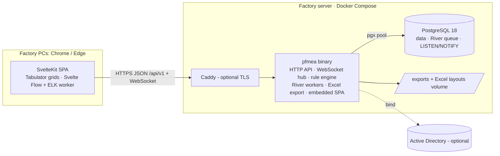

# 03 · Architecture

Guiding principle: **optimisation first, without extra moving parts.** One Go binary, one
PostgreSQL 18 database, a static single-page app embedded in the binary. No ORM, no Redis, no
message broker, no microservices.

## 1. Overview



The browser never talks to the database. The Go server owns all data access through the API
(`docs/05-api.md`); PostgreSQL enforces integrity, derived values and the audit log with
constraints and triggers so that no code path can bypass them.

## 2. Stack and versions

Pin these (or newer patch versions) in `go.mod` and `web/package.json`:

| Layer | Choice | Version | Why |
| --- | --- | --- | --- |
| Language | Go | 1.27 | Compiled, low memory, goroutines for realtime and jobs, single static binary |
| HTTP | `net/http` (Go 1.22+ routing patterns) | stdlib | No framework needed |
| API contract | OpenAPI 3.0.3 → `oapi-codegen` v2 (strict server, std-http) | v2.8+ (needs Go ≥ 1.25) | Typed handlers generated from `api/openapi.yaml` |
| DB driver | `github.com/jackc/pgx/v5` | v5.11+ | Fastest Go Postgres driver, named args, COPY, LISTEN |
| SQL | `sqlc` | v1.31+ | Type-safe Go from plain SQL, no ORM overhead |
| Migrations | `github.com/pressly/goose/v3` | v3.28+ | Plain SQL migrations, embeddable |
| Jobs | `github.com/riverqueue/river` (+ `riverpgxv5`) | v0.49+ | Postgres-backed queue, transactional enqueue (`InsertTx`), periodic jobs |
| WebSocket | `github.com/coder/websocket` | v1.8.15+ | Small, context-aware |
| Excel | `github.com/xuri/excelize/v2` | v2.11+ | Writes .xlsx from templates, merges, A3 page setup |
| LDAP | `github.com/go-ldap/ldap/v3` | v3.4+ | AD bind (M13) |
| Passwords | `golang.org/x/crypto/argon2` | latest | argon2id |
| UUIDs in Go | `github.com/google/uuid` | v1.6+ | `NewV7()` when Go needs ids before insert |
| Compression | `github.com/klauspost/compress/gzhttp` | v1.20+ | gzip for JSON |
| Metrics | `github.com/prometheus/client_golang` | latest | `/metrics` |
| Tests | `testing`, `github.com/testcontainers/testcontainers-go` (postgres module) | v0.44+ | Real PostgreSQL 18 in tests |
| Database | PostgreSQL | 18 | `uuidv7()`, JSONB, triggers, `NULLS NOT DISTINCT`, LISTEN/NOTIFY |
| Frontend | Svelte 5 + SvelteKit 3 (`adapter-static`, SPA mode) | svelte 5.57+, kit 3.0+, adapter-static 4 | Small bundles, fast on low-spec PCs |
| Build | Vite 8, TypeScript 6 | per SvelteKit 3 peer deps | |
| Grid | `tabulator-tables` | 6.6+ | MIT, virtual DOM rendering, clipboard, keyboard editing |
| Diagram | `@xyflow/svelte` + `elkjs` (in a Web Worker) | 1.7+ / 0.12+ | Auto-layout PFD diagram |
| API client | `openapi-typescript` + `openapi-fetch` | 7.13+ / 0.17+ | Types generated from the contract |
| Fonts | IBM Plex Sans / Mono via `@fontsource` | 5.x | Self-hosted (the factory network may be offline) |
| Frontend tests | Vitest 5, Playwright 1.64+ | | Unit and E2E |

## 3. Repository layout and modules

```text
pfmea-system/
├── CLAUDE.md                  instructions for Claude Code (start here)
├── README.md                  for people (Bahasa Indonesia)
├── .github/workflows/ci.yml   GitHub Actions: make check (and make e2e) on every push to main (M0)
├── go.mod                     module pfmea (Go code lives in backend/ and db/)
├── sqlc.yaml                  schema: db/migrations, queries: backend/internal/store/queries
├── Makefile                   see §3.3
├── docker-compose.yml         dev: postgres; profile "prod": app + postgres (+ caddy)
├── .env.example
├── api/
│   ├── openapi.yaml           API contract (source of truth)
│   ├── redocly.yaml           lint rules
│   └── oapi-codegen.yaml      Go generator config
├── db/
│   ├── embed.go               package db: //go:embed migrations/*.sql seed/*.sql
│   ├── migrations/            goose SQL migrations (00001_init.sql exists)
│   └── seed/demo.sql          demo data (dev, tests, Gate 1 rehearsal)
├── backend/
│   ├── cmd/pfmea/main.go      subcommands: serve, migrate, init, seed-demo, perf-gen, perf, xlsx-compare
│   └── internal/
│       ├── config/            env parsing and validation
│       ├── apperr/            Problem type and codes returned by services
│       ├── clock/             injected clock in the plant time zone (fake in tests)
│       ├── i18n/              English server-side texts in en.go (Problem titles, validation messages, activity summaries)
│       ├── testdb/            PostgreSQL 18 test databases (testcontainers or TEST_DATABASE_URL), demo seed
│       ├── httpapi/           router, middleware, handlers implementing gen.StrictServerInterface
│       │   └── gen/           generated by oapi-codegen (never edit)
│       ├── auth/              sessions, argon2id, LDAP, permission functions
│       ├── store/             pgx pool, WithTx helper, error mapping
│       │   ├── queries/       *.sql for sqlc
│       │   └── sqlc/          generated by sqlc (never edit)
│       ├── domain/            entities.go (entity map), enums, validation, labels
│       ├── worksheet/         view queries, create/delete/move, bulk paste
│       ├── changes/           /changes engine: whitelist, locks, overrides, virtual fields
│       ├── rules/             engine + scheduler; sql/ (32 rules), testdata/ (fixtures)
│       ├── template/          columns.go, create-from-template, planner, sync job, release, restore, diff
│       ├── export/            Excel writers, layouts, cache
│       ├── realtime/          pg_notify publisher, LISTEN loop, WebSocket hub, presence
│       ├── jobs/              River client, workers, periodic jobs
│       ├── webui/             //go:embed all:dist (copied from web/build by make)
│       └── repotest/          repository-level tests (Makefile targets, .gitignore); no production code
├── web/                       SvelteKit app (docs/08-screens.md)
│   └── src/lib/{api,components/grid,components/flow,stores,i18n}
├── deploy/                    Dockerfile, Caddyfile, postgresql.conf, backup.sh, restore.sh
├── docs/                      this specification; build-guide.md and test-cases/ are written in Bahasa Indonesia
└── .claude/                   rules, skills and agents for Claude Code
```

### 3.1 Module rules

- Dependency direction: `httpapi` → services (`worksheet`, `changes`, `template`, `rules`,
  `export`, `auth`) → `store` / `domain`. Services never import `httpapi`. `realtime` and
  `jobs` are used by services through small interfaces (`Publisher`, `Enqueuer`) so services
  stay testable.
- Handlers are thin: decode (generated), call one service method, map the result. Permission
  checks live in services.
- `domain/entities.go` is the single map of entity ↔ table ↔ fields ↔ columns ↔ editability;
  `changes`, `worksheet`, `template`, `rules` (object type names) and the paste mapper import it.
- `store.WithTx(ctx, actor, fn)` begins the transaction, runs
  `SELECT set_config('app.user_id', $1, true), set_config('app.request_id', $2, true), set_config('app.source', $3, true)`
  (one round trip, equivalent to `SET LOCAL`), calls `fn`, commits, and maps errors raised at
  `COMMIT` too (deferred unique checks). It retries serialization failures (40001) and
  deadlocks (40P01) up to 3 times.
- Lock order for writes: `package_links` (sync job only) → the package row
  (`SELECT 1 FROM packages WHERE id = $pkg FOR NO KEY UPDATE`, helper `store.LockPackage`) →
  content rows. Every transaction that writes package content takes the package lock first;
  the statement triggers update `packages.content_version`, so without this order concurrent
  writers deadlock. `FOR NO KEY UPDATE` still lets other sessions insert findings, check runs
  and exports that reference the package.
- SQL lives in `store/queries/*.sql` (sqlc) except the dynamic parts that sqlc cannot express
  (the `/changes` UPDATE built from the whitelist, rule files, view queries); those use pgx
  directly with parameters, never string-concatenated values.

### 3.2 Binary subcommands

| Command | Purpose |
| --- | --- |
| `pfmea serve` | HTTP server, WebSocket hub, River workers, rule scheduler |
| `pfmea migrate up|down|status` | goose migrations, then River's own migrations (`rivermigrate`). Reads only `DATABASE_URL`, `DEV_MODE` and `LOG_LEVEL` (`config.LoadDatabase`; no `APP_BASE_URL`). `down` rolls back to version 0, deletes all data and refuses unless `DEV_MODE=true` (decision 2026-10-09). `make migrate` / `make migrate-down` load `.env` and run it through `go run` |
| `pfmea init --admin <username>` | Production bootstrap: create the first admin (password prompted) and an empty Template General (`GENERAL`, documents `SH-GEN`, `SF-GEN`, `SC-GEN`) if none exist |
| `pfmea seed-demo [--reset]` | Load `db/seed/demo.sql`, then (from M8) run a full check of every package. `--reset` first drops the schema and runs the full `migrate up` (goose and River). Refuses unless `DEV_MODE=true`, when the schema is not at the latest migration ("run pfmea migrate up first") and, without `--reset`, when users, customers or packages already exist. Restart a running server after `--reset`. `make seed` loads `.env` and runs it; `make seed RESET=1` adds `--reset`. |
| `pfmea perf-gen` / `pfmea perf` | Generate the performance data set (M6; refuses databases whose name does not end in `_perf`) / measure §9 targets (M13; logs in with `PERF_PASSWORD`, which exists only in a perf database). `docs/11-testing.md` §5 |
| `pfmea xlsx-compare` | Compare an old Excel file with an export, cell text only (Gate 1, `docs/09-excel-export.md` §7) |

### 3.3 Make targets

`make tools` (install pinned sqlc, goose, oapi-codegen, golangci-lint and air (live reload of
`make dev`) into `bin/`, the web dependencies with `npm ci` and, from M2, Playwright Chromium),
`make db` (start PostgreSQL in Docker; host port `PG_PORT`, default 5432, bound to 127.0.0.1), `make migrate`, `make migrate-down`, `make seed`, `make gen`
(oapi-codegen + sqlc + openapi-typescript), `make dev` (loads `.env`; Go server with live reload
+ Vite dev server proxying `/api` to the port of `HTTP_ADDR`), `make test` (Go + Vitest), `make test-rules`, `make e2e`
(Playwright), `make lint` (golangci-lint, `svelte-check`, eslint, redocly), `make perf`,
`make build` (web build → copy to `backend/internal/webui/dist` → `go build`), `make check`
(gen + lint + test + test-rules; must pass before every commit).

## 4. Read models (views)

Each screen loads with one request (`GET /packages/{id}/views/{pfd|pfmea|control-plan}`).
The handler runs one SQL statement that returns the whole JSON document:

```sql
SELECT json_build_object(
  'package', (SELECT json_build_object('id', p.id, 'kind', p.kind, 'code', p.code, …) FROM packages p WHERE p.id = $1),
  'contentVersion', (SELECT content_version FROM packages WHERE id = $1),
  'failureChains', (SELECT coalesce(json_agg(json_build_object(
        'id', c.id, 'failureModeId', c.failure_mode_id, 's', c.s, 'o', c.o, 'd', c.d, 'rpn', c.rpn,
        'origin', c.origin, 'syncStatus', c.sync_status, 'sourceRev', c.source_rev,
        'overrides', (SELECT coalesce(jsonb_object_agg(snake_to_camel(k), v), '{}') FROM jsonb_each(c.overrides) e(k, v)),
        'detachReason', c.detach_reason, 'version', c.version, …) ORDER BY c.seq), '[]')
     FROM failure_chains c WHERE c.package_id = $1),
  …)
```

A complete, validated reference for the heaviest view is
`backend/internal/worksheet/sql/pfmea_view.sql`; write the PFD and Control Plan views the same
way. Rules:

- Go does not decode it: the handler writes the bytes. With the strict server, return a small
  custom response type that implements the generated `Visit<Operation>Response(w)` interface
  and writes `Content-Type: application/json` plus the raw bytes (gzip middleware applies).
- Run the view in a `REPEATABLE READ READ ONLY` transaction so all arrays are consistent.
- Shapes must match `PfdView`, `PfmeaView`, `ControlPlanView` in `api/openapi.yaml`. A contract
  test decodes each view of the demo packages into the generated Go types with
  `DisallowUnknownFields` to catch drift.
- `templatePolicy` is converted from table/column names to entity/field names in SQL with a
  `CASE` over the table name and `snake_to_camel()`.
- Indexes in the migration cover every `package_id` + parent lookup used here.
- PostgreSQL JIT must be off (`jit = off` in `deploy/postgresql.conf`; tests set it per
  session): on the 3,000-chain view JIT compilation added 100–200 ms.

## 5. Write path

```text
request → recover → request id → access log → security headers → gzip → session auth
        → Origin check (non-GET) → handler (generated decode) → service
service: validate → permissions → store.WithTx {
           SET LOCAL app.* → lock package row (FOR NO KEY UPDATE) → SELECT … FOR UPDATE (when needed)
           → UPDATE/INSERT/DELETE
           → triggers: version, updated_at, s, rpn, content_version, audit_log
           → pg_notify('pfmea_events', event)       -- delivered only on commit
         } → rules scheduler.Notify(packageId, touchedTables) → response
```

- One request = one transaction. Never call the network or the file system inside a
  transaction (exports write files outside it).
- Bulk operations (paste, create-from-template, sync) use `pgx.Batch` or `COPY` into
  temporary tables, not one round trip per row.
- `content_version` is the package-level change counter: export cache key, stale-view
  detection, release guard.

## 6. Realtime

- Publisher: `realtime.Publish(ctx, tx, event)` → `SELECT pg_notify('pfmea_events', $1)`.
  Payload over 7,900 bytes → replaced by `package.reload` (or `findings.changed` with
  `reload: true`).
- Listener: one dedicated pgx connection runs `LISTEN pfmea_events` and reconnects with backoff;
  on reconnect it sends `package.reload` to all subscribers (events may have been missed).
- Hub: map `packageId → set of connections`; per-connection buffered send channel (64
  messages); a slow client whose buffer is full is disconnected (it reconnects and reloads).
- Presence: in memory, per package, debounced 250 ms.
- Protocol: `docs/05-api.md` §10.

## 7. Background work

| Work | Where | Notes |
| --- | --- | --- |
| Save-triggered rule checks | In-process scheduler (`rules.Scheduler`) | Coalesced per package, 150 ms debounce, bounded by the rule pool (`docs/06-rules.md` §2–3) |
| Template sync | River job `template_sync` (queue `sync`, 4 workers) | Enqueued with `InsertTx` in the release transaction |
| Checks after master-data changes | River job `check_packages` | |
| Nightly checks | River periodic job at `nightly_check_time` (plant time zone) | Enqueues `check_packages` for all packages |
| Excel export | River job `export_file` (queue `exports`, 2 workers) | |
| Cleanup | River periodic job, daily | Expired sessions; export files older than 30 days and not the latest per document |

River runs inside `pfmea serve` with `RIVER_WORKERS` workers on the default queue. Its tables
are created by `pfmea migrate`.

## 8. Security, configuration, operations

**Security**

- Cookie sessions, Origin check, JSON-only mutations, argon2id, login rate limit
  (`docs/05-api.md` §3).
- Headers: `Content-Security-Policy: default-src 'self'; connect-src 'self'; img-src 'self' data:; style-src 'self' 'unsafe-inline'; frame-ancestors 'none'`
  (inline styles are needed by the grid and diagram libraries), `X-Content-Type-Options: nosniff`,
  `Referrer-Policy: same-origin`.
  SvelteKit's SPA fallback page starts the app with one inline `<script>`, which
  `default-src 'self'` would block. Decision (2026-10-09): the server computes the SHA-256 hash of
  every inline script of the embedded `index.html` once at start-up (`webui`) and sends
  `script-src 'self' 'sha256-…'` in the same header. The CSP stays a response header (a `<meta>`
  CSP cannot carry `frame-ancestors`), no `'unsafe-inline'` is allowed for scripts, and the
  hash follows every rebuild automatically. In `make dev` the Vite server serves the pages, so
  the header applies to the binary only.
- The database user of the app owns the schema in Phase 1; `audit_log` is append-only by
  convention (no UPDATE/DELETE statements exist in the code).
- Uploaded/pasted text is data only; the UI renders it as text, never as HTML.
- Licensed AIAG text (S/O/D criteria, AP tables) is never committed; it is entered as master
  data by the company.

**Configuration (environment variables)**

| Variable | Default | Meaning |
| --- | --- | --- |
| `DATABASE_URL` | required | `postgres://…` |
| `HTTP_ADDR` | `:8080` | Listen address |
| `APP_BASE_URL` | required | Public URL; used for the Origin check and cookie `Secure` flag |
| `SESSION_TTL` | `12h` | Sliding session lifetime |
| `EXPORT_DIR` | `/data/exports` | Generated files |
| `EXPORT_TEMPLATE_DIR` | `/data/templates` | Company Excel layouts (`docs/09-excel-export.md`) |
| `DB_MAX_CONNS` | `20` | Main pgx pool (API requests and River) |
| `RIVER_WORKERS` | `10` | Default queue workers |
| `RULE_POOL_SIZE` | `8` | Separate pool of the rule engine |
| `RULE_PARALLELISM` | `4` | Connections one check uses from the rule pool |
| `LOG_LEVEL` | `info` | `debug`, `info`, `warn`, `error` |
| `METRICS_ALLOW` | `127.0.0.1/32` | CIDRs allowed to read `/metrics` |
| `DEV_MODE` | `false` | Enables `seed-demo`, verbose errors in logs, Vite proxy |
| `DEV_FAKE_TODAY` | empty | `YYYY-MM-DD` used as "today" by rules and dates; honoured only with `DEV_MODE=true` (E2E) |
| `LDAP_URL`, `LDAP_BIND_DN`, `LDAP_BIND_PASSWORD`, `LDAP_BASE_DN`, `LDAP_USER_FILTER`, `LDAP_START_TLS` | empty = LDAP off | M13 |

Plant time zone, review interval, nightly time and document number pattern are application
settings in the database (`app_settings`), editable by the admin.

Connection budget with the defaults: main pool 20 + rule pool 8 + 1 LISTEN connection = 29,
well below `max_connections = 100`, leaving room for backups, `psql` and a second app instance
during upgrades.

**Observability**

- `log/slog` JSON logs with `request_id`, `user_id`, `package_id`, route, status, duration.
- `/metrics` (Prometheus): HTTP duration histogram per route, pool stats, check duration per
  trigger, sync duration, export duration, WebSocket connections, River queue depth.
- `/healthz` (process alive) and `/readyz` (database reachable and migrations current).
  Bodies (decided in M0): `/healthz` → 200 `{"status":"ok"}`; `/readyz` runs the registered
  checks in parallel (2 s timeout each) → 200 `{"status":"ready","checks":[{"name":…,"status":"ok"}]}`
  or 503 `{"status":"not_ready",…}` with `failed` checks; error details go to the log only. The
  check `database` (M1) reads `max(version_id)` from `goose_db_version` through the server pool
  and compares it with the latest embedded migration; it does not call goose, which would create
  its table in an empty database (`db.CheckSchema`, also used by `seed-demo`). Both
  send `Cache-Control: no-store`. Unknown paths under `/api` answer 404 Problem `not_found`,
  never the SPA; a binary built without the web build answers 503 "UI not built yet".

**Deployment and backups**

- `docker-compose.yml` profile `prod`: `app` (distroless image built by `deploy/Dockerfile`),
  `db` (`postgres:18`, tuned `deploy/postgresql.conf`: `jit = off`, `shared_buffers` 25 % of RAM,
  `effective_cache_size` 50–75 %, `work_mem` 16–32 MB, `max_connections` 100, WAL archiving), optional `caddy` for TLS with the
  company certificate. Volumes: `pgdata`, `exports`, `templates`, `backups`.
- `deploy/backup.sh` (cron, nightly): `pg_dump -Fc` with 14-day retention, plus WAL archiving
  (`archive_command`) for point-in-time recovery; copies to the backup target chosen by IT.
- `deploy/restore.sh`: restore a dump into a fresh database and run `pfmea migrate status`.
  Gate 1 requires a successful restore on a second machine.

## 9. Performance targets

Server time, measured by `make perf` on the factory server with the generated data set
(`pfmea perf-gen`: package `PERF-3000` with 1,000 failure modes × 3 causes = 3,000 chains,
6,000 controls, 2,000 CP lines; 24 model packages linked to Template General in total).

| Operation | Target (p95) | How `pfmea perf` measures it |
| --- | --- | --- |
| Save one cell (`/changes`, one field) | < 50 ms | 200 sequential saves on random chains |
| Open a 3,000-row worksheet (`/views/pfmea`) | < 300 ms | 20 requests, time to last byte |
| Full check of one package | < 2 s | 10 `POST /checks` on PERF-3000 |
| Incremental check after a save | < 300 ms | Save → `findings.changed` event |
| Template release synced to 24 packages | < 10 s | Release → sync run `done` |
| Excel export (PFMEA, PERF-3000, uncached) | < 3 s | 5 runs, cache cleared |
| Dashboard | < 100 ms | 50 requests |

Client targets (low-spec PC, Chrome): first paint of a 3,000-row PFMEA grid < 1 s after the
data arrives; typing in a cell never blocks (saves are asynchronous and batched per gesture).

Measured while writing the spec (2-vCPU VM, PostgreSQL 16, `jit = off`, generated package with
3,000 chains, 6,000 controls, 500 actions): the reference PFMEA view query took 150–205 ms and
produced 5.5 MB of JSON (0.8 MB gzipped); all 32 rule queries together took about 145 ms.

The levers that make these numbers reachable: one SQL statement per view streamed as bytes;
one batched request per edit gesture and one UPDATE per row; derived values in triggers;
incremental, coalesced, parallel rule checks; counters in `package_stats`; export cache by
`content_version`; virtual DOM rendering in Tabulator; ELK layout in a Web Worker; gzip.

## 10. Decision log

| # | Decision | Reason | Rejected |
| --- | --- | --- | --- |
| D1 | Go single binary | Lowest latency and memory per request, real concurrency for WebSocket and jobs, one artifact to deploy on-prem | PHP/Laravel (per-request bootstrap, needs extra workers/queues), Node (single thread for CPU-heavy checks/exports) |
| D2 | PostgreSQL 18 as the only infrastructure | Integrity in constraints and triggers, JSON read models, LISTEN/NOTIFY, job queue (River), `uuidv7()` | Redis, message brokers |
| D3 | API-first: JSON HTTP API described by OpenAPI, the browser never touches the database | One contract for the UI and the future MES/ERP read API, generated types on both sides, clear security boundary, testable without a browser. Costs: contract work up front, version discipline, serialization overhead (mitigated by §4) | Server-rendered pages talking to the DB directly; GraphQL (more complex caching and authorization) |
| D4 | SPA embedded in the binary | Spreadsheet-like editing needs client state; static files are free to serve | SSR |
| D5 | sqlc + plain SQL | Performance and control, SQL reviewable by DB-literate engineers | ORMs |
| D6 | River for background jobs | Transactional enqueue in the same database, no extra service | Separate queue servers |
| D7 | Tabulator grid | MIT licence, virtual rendering, clipboard and keyboard editing | AG Grid (enterprise features licensed), hand-written tables |
| D8 | Rules as SQL files with fixtures | Set-based checks are fast in the database; each rule is small and testable | Rules in application code iterating rows |
| D9 | Optimistic locking per row + client rebase | No lock management; field-level merge in the client | Pessimistic locks, CRDTs |
| D10 | Events via `pg_notify` inside the write transaction | Delivered only on commit; works for API writes and background jobs alike | In-memory only events |
| D11 | In-process coalescing rule scheduler | Lowest latency for save-triggered checks; River for durable work | One River job per save |
| D12 | English UI, Indonesian code comments | Users and customers read English documents; the plant team maintains the code in its own language | Indonesian UI |
| D13 | One branch (`main`), test cases written before code, CI on every push | Simple flow for a small team; every change is specified by its tests and checked by CI | Feature branches with pull requests |
