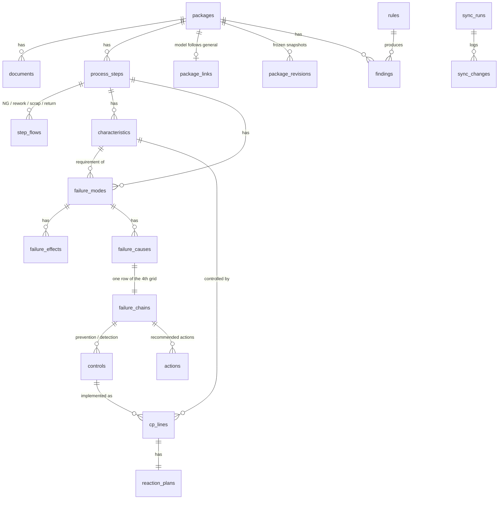

# 04 · Data model

The source of truth is `db/migrations/00001_init.sql` (PostgreSQL 18, goose). This document
explains the intent, the invariants and the JSON formats. If the two disagree, the SQL wins and
this file must be corrected in the same change.

The schema, the demo seed (`db/seed/demo.sql`) and the 32 rule queries were executed together
while writing this spec: migration up and down, seed, trigger behaviour and every rule fixture.
That run used PostgreSQL 16 with a stand-in `uuidv7()` function; milestone M1 repeats it on
PostgreSQL 18, the production target.

## 1. Conventions

- **Ids:** `uuid` primary keys with `DEFAULT uuidv7()` (time-ordered, built into PostgreSQL 18).
  The server always generates ids; the client uses temporary ids until the create call returns.
- **Optimistic locking:** editable rows have `version integer`. The trigger `trg_touch_row`
  increments it on every user-meaningful change and sets `updated_at`. Derived columns passed as
  trigger arguments (for example `failure_chains.s`, `rpn`) never bump the version. Every API
  update is `UPDATE … WHERE id = $id AND version = $expected`; zero rows means 409.
- **Business keys:** `op_no` and `char_no` are unique per package, and step `seq` too; these
  unique constraints are `DEFERRABLE INITIALLY DEFERRED`, so renumbering, restore and sync can
  swap values inside one transaction (a real duplicate fails at `COMMIT`).
- **Package scoping:** every content row has `package_id`. Composite foreign keys
  `(package_id, x_id) → x (package_id, id)` make cross-package references impossible.
- **Template link columns** on every content table except `actions`:
  `origin` (`local` | `general`), `source_id` (template row id), `source_rev`,
  `sync_status` (`in_sync` | `override` | `review` | `detached`), `overrides` (jsonb),
  `detach_reason`. Rows inside the general package itself are `origin = 'local'`.
- **Enums** are PostgreSQL enum types. Values needed by later phases already exist
  (`AIAGVDA1`, `CP1`, `safe_launch`, workflow statuses); Phase 1 code must not write them.
- **Text that users type** is `text NOT NULL DEFAULT ''` where an empty grid cell is a valid
  intermediate state (rules report it); otherwise `NULL` means "not provided".
- **Names:** snake_case in the database, camelCase in JSON. The API maps table names to entity
  names (`failure_chains` → `failureChain`), see `docs/05-api.md` §4.

## 2. Entity overview



## 3. Tables

| Group | Table | Purpose and key invariants |
| --- | --- | --- |
| Identity | `users`, `sessions` | Local or LDAP users with one global role. Sessions store `sha256(token)`, never the token. |
| Master | `customers` | `code` is used in document numbers. `rpn_action_threshold` (F08) and `cc_min_severity` (S04) are NULL = off. |
| | `sc_symbols`, `customer_sc_symbols` | Company classes (CC, SC) and what each customer prints for them (S02). |
| | `parts` | Part number and current change level (K06 compares document headers with it). |
| | `control_library` | Standard controls. `d_min` is the best D a detection method can justify (R04). `is_strong` / `is_error_proofing` feed S03. |
| | `rating_criteria` | S/O/D criteria text per methodology, entered by the company from its licensed manual. |
| | `banned_terms` | F12 dictionary, case-insensitive substring match. |
| | `app_settings` | `doc_number_pattern`, `review_interval_months`, `plant_timezone`, `nightly_check_time`. |
| Packages | `packages` | `kind` general or model. Exactly one general package in Phase 1. `revision` = last released revision (general: template revision). `content_version` is bumped by triggers on any content change and drives export caching and client freshness. |
| | `documents` | One PFD, one PFMEA, one CP per package; `doc_no` unique; `header` jsonb (§5). |
| | `package_members` | Extra editors besides the owner. |
| | `package_revisions` | Frozen `package_snapshot()` per release (§6) and the `content_version` it was taken at. Phase 1: Template General releases. |
| Content | `process_steps` | `op_no` unique per package (multiples of 10, inserts like 25), `seq` orders the flow (deferrable unique). `machines text[]`. `general_mode` only in the general package. `not_analyzed` + reason exempts a step from K01. |
| | `step_flows` | Only non-trivial edges: `ng`, `rework`, `scrap`, `return` (and `normal` when branching later). The main flow is the `seq` order. `to_step_id` NULL means the part leaves the flow (scrap, hold, return to supplier). |
| | `characteristics` | Product or process characteristic of a step. `char_no` like `30-01`. `sc_symbol_id` is the single source of the special-characteristic class shown in PFMEA (Class) and CP. |
| | `failure_modes` | One failure mode per row (F02 warns on combined text). Belongs to a step and violates one characteristic (the 4th "Requirements" column). |
| | `failure_effects` | Effects per failure mode with `level` (your plant, ship-to plant, end user) and `s`. |
| | `failure_causes` | Causes per failure mode. |
| | `failure_chains` | One row per cause (= one row of the AIAG 4th worksheet). `s` is a trigger-maintained cache of `max(failure_effects.s)` of the failure mode; `rpn` is a generated column; `ap` reserved for Phase 2. `justification` answers F07/F08; `o_evidence` answers R05. |
| | `controls` | Prevention or detection control of a chain, optionally linked to `control_library`. `is_system_control` + reason exempts a prevention control from R02. |
| | `actions` | Recommended actions (never copied from the template). `new_rpn` generated. `completed_on` required when `status = 'done'`. |
| | `cp_lines` | Control Plan line per phase, step and characteristic. `control_id` links the PFMEA control it implements; `failure_mode_id` links the failure mode it covers. `machines` must be a subset of the step machines (K05). |
| | `reaction_plans` | 1:1 with a CP line. Template A uses `text`; the structured columns are for CP-1 (Phase 2). |
| Checks | `rules`, `rule_overrides` | 42 rules seeded by the migration with phase 1 or 2. Customer overrides of level / enabled. |
| | `check_runs`, `findings` | One finding per fingerprint per package. Status `open` → `fixed` automatically; `waived` only for Warning/Info, with reason and user. |
| | `package_stats` | Counters for the dashboard, refreshed at the end of every check run and by waive / unwaive. |
| Template | `package_links` | Which general package and revision a model follows, plus sync state. |
| | `sync_runs`, `sync_changes` | One run per template release; one change row per updated cell, inserted row, deleted row or conflict. Conflicts carry `resolved_at`, `resolution`. |
| Other | `export_files` | Export cache keyed by package, document, phase, format and `content_version`. |
| | `audit_log` | Written by statement-level triggers on every content, master and configuration table (`customer_sc_symbols`, `rating_criteria`, `app_settings`, `rules`, `rule_overrides`, `package_members` carry a surrogate `id` for this): who (`app.user_id`), what (changed columns only for updates), request id, source. |

## 4. Derived values and triggers

| Value | How it is kept correct |
| --- | --- |
| `failure_chains.s` | `failure_chains_s_ins` (before insert) and `failure_effects_chain_s` (after effect insert/update/delete) set it to the highest effect S of the failure mode. The API never writes it. |
| `failure_chains.rpn`, `actions.new_rpn` | Generated columns `s * o * d`. NULL while any factor is NULL. |
| `version`, `updated_at` | `trg_touch_row` before update; unchanged rows keep their version. |
| `packages.content_version` | Statement-level triggers on content tables add 1 per statement per touched package. |
| `audit_log` | Statement-level triggers. Updates store only changed columns; derived caches are ignored. |

The API must run every write transaction with:

```sql
SET LOCAL app.user_id = '<uuid>';
SET LOCAL app.request_id = '<request id>';
SET LOCAL app.source = 'api';   -- 'sync' for template sync jobs, 'seed' for seeds
```

## 5. Document header keys (`documents.header`)

Header values are free text unless stated. Keys are camelCase.

| Document | Keys |
| --- | --- |
| PFD | `partNo`, `partName`, `changeLevel`, `customer`, `preparedBy`, `date` |
| PFMEA (AIAG4) | `item`, `modelYearProgram`, `coreTeam`, `processResponsibility`, `keyDate`, `fmeaNo` (defaults to `doc_no`), `preparedBy`, `dateOrig`, `dateRev`, `partNo`, `changeLevel` |
| CP (APQP2) | `phase` (`prototype` / `pre_launch` / `production`), `cpNo` (defaults to `doc_no`), `keyContact`, `dateOrig`, `dateRev`, `partNo`, `changeLevel`, `partName`, `supplierPlant`, `supplierCode`, `coreTeam`, `approvals` (object: `supplierPlant`, `customerEngineering`, `customerQuality`, `other`, each `{name, date}`) |

When a model package is created, `partNo`, `partName`, `changeLevel` and `customer` are filled
from the part and customer. K06 reports headers that later disagree with the part.

## 6. JSON formats

**Overrides** (`<content table>.overrides`), keyed by database column name:

```json
{
  "sample_freq": {
    "reason": "Sampling agreed with Customer B",
    "by": "0f6c…-user-uuid",
    "at": "2026-08-20T10:15:00+07:00",
    "templateValue": "Every lot"
  }
}
```

`templateValue` is the template value the override was made against. The sync compares the
new template value with it to decide whether a conflict happened (`docs/07-template-general.md`).

**Snapshot** (`package_revisions.snapshot`), produced by `SELECT package_snapshot(package_id)`:

```json
{
  "schema": 1,
  "packageId": "…",
  "takenAt": "2026-10-08T09:00:00+07:00",
  "tables": {
    "documents": [ { "id": "…", "doc_type": "PFD", "header": { } } ],
    "process_steps": [ { "id": "…", "op_no": "10", "name": "Part receiving", "general_mode": "mandatory" } ],
    "step_flows": [], "characteristics": [], "failure_modes": [], "failure_effects": [],
    "failure_causes": [], "failure_chains": [], "controls": [], "actions": [],
    "cp_lines": [], "reaction_plans": []
  }
}
```

Rows are `to_jsonb(row)`, so keys are database column names. Read them in SQL with
`jsonb_to_recordset(snapshot -> 'tables' -> 'process_steps') AS t(id uuid, …)` or decode them in
Go into structs that use the same snake_case tags.

## 7. Read models

Screens load one JSON document per view, built in PostgreSQL with `json_agg` so Go only streams
bytes (see `docs/03-architecture.md` §4). Required shapes are in `api/openapi.yaml`
(`PfdView`, `PfmeaView`, `ControlPlanView`). Rules for these queries:

- one round trip per view, no N+1;
- normalized: one array per entity (steps, characteristics, failure modes, effects, …), each
  object referencing its parent by id; the client joins them into grid rows;
- ordering: steps by `seq`, children by `seq` within their parent, CP lines by step `seq`
  then `seq`;
- include `version` and the template link fields (`origin`, `syncStatus`, `sourceRev`,
  `overrides` with camelCase keys via `snake_to_camel()`, `detachReason`) for every editable
  entity, plus the package's `templatePolicy` once at the top level, so the client can derive
  which cells are locked or overridable (`docs/05-api.md` §5);
- include `contentVersion` so the client can detect stale data.

There is also a small SQL helper, `snake_to_camel(text)`, used wherever a database column name
must become an API field name (view override keys, rule T03).

## 8. Demo data

`db/seed/demo.sql` (dev, tests and the Gate 1 rehearsal; never production) contains:

- users `admin`, `rsaputri` (approver), `apratama`, `dhidayat` (authors), `swulandari`
  (reviewer), `operator1` (viewer); password `pfmea-dev-2026`;
- customers CA and CB (CB requires CC with S ≥ 9 and has no CC symbol mapping);
- Template General `GENERAL` released as rev 1: steps 10, 20, 25, 65 (optional), 100, 110 with
  full PFMEA and CP content; it produces zero findings;
- model package `PS-07` (Customer B, AIAG 4th, Template A) built from rev 1 plus model steps
  50, 60, 70, 75, 90; one local override on CP line 20-02 (`sample_freq`); it produces exactly
  14 findings, listed in `docs/06-rules.md` §5.

Row ids are deterministic (uuid5), so tests can refer to them.
